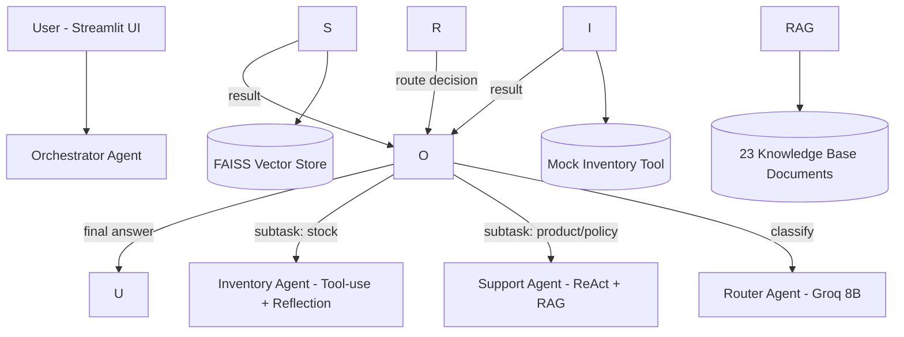
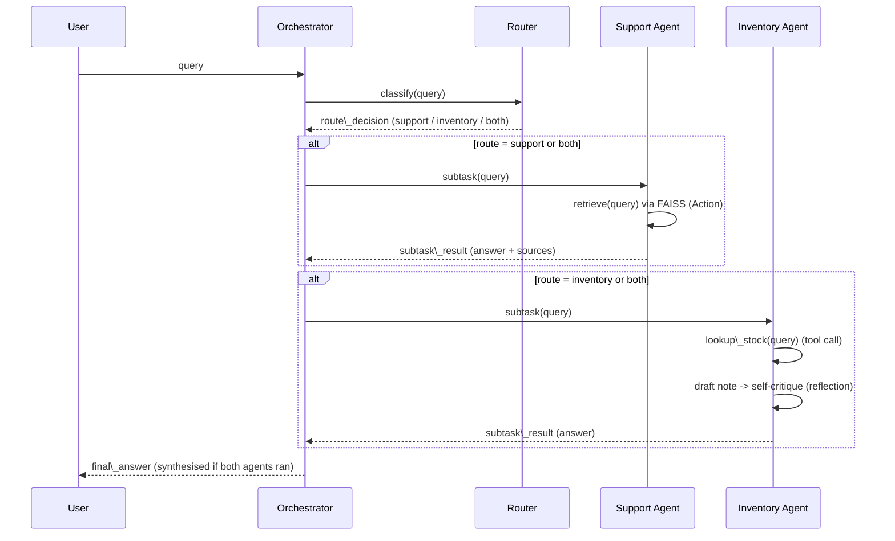

# Serendib Spice \& Tea Traders — Agentic AI Co-Pilot

An internal, agentic AI assistant built for a fictional-but-realistic Sri Lankan
spice \& tea **export SME**. Customer-facing and internal staff can ask natural
language questions about products, export policies, shipping, certification,
and live stock levels, and get answers grounded in the company's actual
documents and inventory data — not hallucinated.

**Live demo:** *\[add your deployed Streamlit Community Cloud URL here before submission]*

\---

## 1\. Problem this solves

A small spice/tea export business fields the same categories of question
repeatedly from buyers and staff — MOQs, certifications, shipping lead times,
payment terms — while also needing to track stock levels and flag reorders.
A single generic chatbot either hallucinates policy details (risky in an
export/compliance context) or can't reason about live stock at all. This
project splits the problem across specialised agents so that:

* Policy/product questions are **grounded in retrieval** (RAG) over the
company's real documents, with sources cited.
* Stock questions go through an **inventory tool + self-critique** step, so a
reorder suggestion can't recommend a quantity below the supplier MOQ.
* A **router** keeps routine classification cheap and fast, while the
higher-cost reasoning model is reserved for the answer that actually reaches
the user.

\---

## 2\. Architecture



All inter-agent hops are structured `AgentMessage` objects recorded on a
shared `MessageBus` (see `src/agents/protocol.py`), which the UI renders as an
inspectable trace for every query.

### Agent-to-agent sequence diagram



\---

## 3\. Agentic design patterns implemented

At least three were required; this project implements **four**, each in a
distinct, named location:

|#|Pattern|Where it lives|Why this pattern|
|-|-|-|-|
|1|**Router**|`src/agents/agents.py::RouterAgent.classify`|Cheap, fast intent classification decides which specialised worker(s) handle the query, instead of one model doing everything.|
|2|**ReAct / Tool-use**|`src/agents/agents.py::SupportAgent.handle`|The agent takes an explicit Action (call the `search\_kb` retrieval tool), receives an Observation (retrieved chunks), then answers strictly grounded in that observation — not memory.|
|3|**Tool-use + Reflection / self-critique**|`src/agents/agents.py::InventoryAgent.handle`|The agent calls the inventory tool, drafts a recommendation, then a second pass explicitly checks the draft against the raw tool data (e.g. does the reorder quantity meet the MOQ?) before finalising.|
|4|**Orchestrator–Worker / planning-decomposition**|`src/agents/agents.py::OrchestratorAgent.handle\_query`|The top-level agent decides whether a query needs one or two worker agents, dispatches subtasks, and — when both are needed — runs an explicit aggregation/synthesis step to merge worker outputs into one coherent answer.|

\---

## 4\. Agent-to-agent communication

Implemented as a **custom protocol** (`src/agents/protocol.py`), deliberately
inspired by the envelope shape used in MCP/A2A-style messages, rather than
adopting LangGraph/CrewAI/AutoGen wholesale — this keeps every hop explicit
and inspectable in the UI's trace panel (useful both for debugging and for
demonstrating the communication pattern clearly).

Each `AgentMessage` carries: `sender`, `receiver`, `type`, `content`,
structured `context`, a unique `message\_id`, and `parent\_id` for threading.
Every message is recorded on a `MessageBus` per user turn. See the sequence
diagram above for the exact message flow, and the "Agent-to-agent trace"
expander in the running app for a live example.

\---

## 5\. Model selection strategy

We use **two providers** (Groq and OpenRouter) and **three distinct models**,
each assigned to a sub-task deliberately, not uniformly. Configured centrally
in `src/models/clients.py::MODEL\_REGISTRY`.

|Sub-task|Model (provider)|Latency|Cost|Context window|Reasoning need|Why chosen|
|-|-|-|-|-|-|-|
|Intent routing (classification)|**Llama 3.1 8B Instant** (Groq)|Very low (Groq's LPU inference, typically <300ms)|Very low / near-free per token|128K (unused at this size of task)|Low — single-label classification|Routing must not become the bottleneck for every single query; an 8B model easily handles a 3-way classification, and Groq's inference speed keeps the whole pipeline feeling responsive.|
|Retrieval re-rank / reflection \& self-critique|**Llama 3.3 70B Versatile** (Groq)|Low-moderate (still Groq-hosted, fast relative to typical API latency)|Low|128K|Moderate — needs to catch logical errors (e.g. quantity below MOQ)|A meaningfully more capable model than the 8B router is needed to reliably self-critique a draft against raw data, but full frontier-model cost/latency isn't justified for an internal ops note. Still on Groq to keep latency low since this runs twice per inventory query (draft + critique).|
|Deep reasoning / final synthesis (customer/policy-facing answers)|**Claude 3.5 Haiku** (OpenRouter)|Moderate (standard hosted API latency, no Groq-class acceleration)|Moderate — higher than Groq-hosted open models, still inexpensive relative to top-tier models|200K|High — must stay faithful to retrieved policy text, cite sources correctly, and combine multi-agent outputs coherently|This is the answer the customer/buyer actually reads, in a compliance-sensitive export context (certifications, payment terms, shipping). The higher reasoning/faithfulness quality justifies the extra cost and latency versus the Groq-hosted models used upstream.|

**Design principle applied:** cost and latency scale *down* the closer a call
is to an internal, high-volume, low-stakes step (routing); reasoning quality
is spent where the output is user-facing and factually sensitive
(synthesis). This mirrors how a production system would actually be tuned to
control spend rather than calling a frontier model for every hop.

\---

## 6\. Retrieval-Augmented Generation (RAG) pipeline

Implemented in `src/rag/pipeline.py` (+ `src/rag/chunking.py`).

**Corpus:** 23 synthetic-but-realistic domain documents under
`data/knowledge\_base/` covering:

* 10 product sheets (spices, tea, vanilla, coconut products — SKUs, grades,
MOQs, lead times, stock, shelf life)
* 10 company policy documents (shipping, payment terms, returns/claims,
quality certification, export documentation, MOQ policy, packaging,
storage/handling, sustainability, complaint handling)
* 3 FAQ documents (general, international shipping, bulk/container orders)

These were authored to mirror the kind of document set a real spice/tea
exporter maintains (product sheets + policy documents + FAQs), with
internally consistent figures (e.g. the same stock numbers appear in the
product sheets and in the mock inventory tool used by the Inventory Agent).

**Chunking strategy** (`src/rag/chunking.py::split\_text`): paragraph-aware
recursive splitting, target chunk size 800 characters with 120-character
overlap between consecutive chunks. Paragraphs are kept intact where they
fit (so a single FAQ Q/A pair or policy clause isn't split mid-thought);
oversized paragraphs fall back to hard character windows. This produced 31
chunks from the 23 source documents.

**Embedding model:** `sentence-transformers/all-MiniLM-L6-v2` — runs
locally (no per-embedding API cost or latency), 384-dimensional, small
enough to load comfortably on Streamlit Community Cloud's free tier, and
more than adequate for short domain documents like ours.

**Vector store:** FAISS (`IndexFlatIP` over L2-normalised embeddings, i.e.
cosine similarity), persisted to `data/index/` after first build so the app
doesn't re-embed the corpus on every restart. Chosen over Chroma to avoid
the SQLite version conflicts Chroma sometimes hits on Streamlit Cloud, and
because our corpus scale (tens of documents) doesn't need a hosted vector
DB.

### Retrieval evaluation

The formal evaluation script is `scripts/eval\_retrieval.py`, which runs 5
representative queries against the **real, shipped** embedding-based
pipeline. **Run it yourself** after `pip install -r requirements.txt` in an
environment with internet access (needed once, to download the embedding
model), then paste the output below:

```bash
python scripts/eval\_retrieval.py
```

*QUERY: What is the minimum order quantity for cardamom?*


&#x20; *\[1] source=policy\_moq.md  score=0.588*

&#x20;     *# Minimum Order Quantities (MOQ) Policy MOQs vary by product and are listed on individual product sheets. General guidance: - High-volume spices (pepper, turmeric, cinnamon): 250-1,000kg MOQ - Low-volume/seasonal items (...*


&#x20; *\[2] source=faq\_bulk\_orders.md  score=0.559*

&#x20;     *-15% preferential pricing versus LCL (less than container load) equivalents, reflecting reduced per-unit handling costs. Q: How far in advance should I place a container order for seasonal items like cardamom? A: At leas...*


&#x20; *\[3] source=product\_cardamom.md  score=0.467*

&#x20;     *# Product: Green Cardamom (Elettaria cardamomum) SKU: SST-CAR-022 Category: Spices Origin: Central highlands, Nuwara Eliya region Grades: 8mm Bold, 7mm, Mixed Packaging: 10kg vacuum-sealed bags, 50g/100g retail tins MOQ:...*


*================================================================================*

*QUERY: Do you offer Halal or Kosher certification?*


&#x20; *\[1] source=policy\_quality\_certification.md  score=0.452*

&#x20;     *# Quality Assurance \& Certification All products undergo in-house quality control including moisture content testing, foreign matter screening, and microbiological testing on sample batches. Certifications held: ISO 2200...*


&#x20; *\[2] source=policy\_export\_documentation.md  score=0.368*

&#x20;     *# Export Documentation Requirements Standard document set provided with every shipment: 1. Commercial Invoice 2. Packing List 3. Bill of Lading (or Airway Bill for air shipments) 4. Certificate of Origin (issued via Ceyl...*


&#x20; *\[3] source=policy\_sustainability.md  score=0.325*

&#x20;     *# Sustainability \& Ethical Sourcing Practices Sourcing is conducted through a network of small-holder farmer cooperatives across the identified growing regions, with direct-trade relationships covering approximately 60% ...*


*================================================================================*

*QUERY: What are the payment terms for a new buyer?*


&#x20; *\[1] source=policy\_payment\_terms.md  score=0.561*

&#x20;     *# Payment Terms Policy Standard terms for new buyers: 30% advance payment on order confirmation, 70% balance against copy of Bill of Lading (CAD - cash against documents). Established buyers (3+ completed orders): Letter...*


&#x20; *\[2] source=policy\_complaint\_handling.md  score=0.303*

&#x20;     *# Complaint Handling Procedure Step 1: Buyer submits complaint via email to the assigned account contact, including order reference number, description of issue, and supporting evidence (photos, lab reports where relevan...*


&#x20; *\[3] source=faq\_international\_shipping.md  score=0.239*

&#x20;      *time, buyers are offered either a partial pre-shipment or a price review if raw material costs have changed materially. Q: Can shipments be tracked? A: Yes, a Bill of Lading / Airway Bill number is provided once cargo i...*


*================================================================================*

*QUERY: How long does shipping take to the EU?*


&#x20; *\[1] source=policy\_shipping.md  score=0.610*

&#x20;     *# Shipping \& Logistics Policy All export shipments are handled FOB Colombo unless CIF or DDP terms are contractually agreed. Standard sea freight lead time to major ports: - EU (Rotterdam/Hamburg): 24-30 days - USA (East...*


&#x20; *\[2] source=faq\_international\_shipping.md  score=0.468*

&#x20;      *time, buyers are offered either a partial pre-shipment or a price review if raw material costs have changed materially. Q: Can shipments be tracked? A: Yes, a Bill of Lading / Airway Bill number is provided once cargo i...*


&#x20; *\[3] source=policy\_returns\_refunds.md  score=0.413*

&#x20;     *# Returns, Refunds \& Claims Policy Quality claims must be submitted within 14 days of container arrival at destination port, accompanied by an independent inspection report (e.g. SGS, Bureau Veritas, or equivalent) and p...*


*================================================================================*

*QUERY: What happens if I receive damaged goods and want a refund?*


&#x20; *\[1] source=policy\_returns\_refunds.md  score=0.498*

&#x20;     *# Returns, Refunds \& Claims Policy Quality claims must be submitted within 14 days of container arrival at destination port, accompanied by an independent inspection report (e.g. SGS, Bureau Veritas, or equivalent) and p...*


&#x20; *\[2] source=policy\_complaint\_handling.md  score=0.359*

&#x20;     *# Complaint Handling Procedure Step 1: Buyer submits complaint via email to the assigned account contact, including order reference number, description of issue, and supporting evidence (photos, lab reports where relevan...*


&#x20; *\[3] source=policy\_returns\_refunds.md  score=0.327*

&#x20;     *ustom-blended or private-label packaging orders once production has started, except in cases of proven quality defect. R ustom-blended or private-label packaging orders once production has started, except in cases of pro...***Development-time sanity check (already run, TF-IDF baseline):** before
wiring up the embedding model, we validated the corpus and chunking design
with a simple TF-IDF cosine-similarity baseline over the same 31 chunks,
run in this dev environment (no external API/model download required):

|Query|Top-1 result|Correct?|
|-|-|-|
|"What is the minimum order quantity for cardamom?"|`faq\_general.md` (mentions MOQ policy exists)|Partially — `policy\_moq.md` ranked #2|
|"Do you offer Halal or Kosher certification?"|`policy\_export\_documentation.md`|Yes — this is where Halal/Kosher lead times are documented|
|"What are the payment terms for a new buyer?"|`policy\_payment\_terms.md`|Yes|
|"How long does shipping take to the EU?"|`policy\_export\_documentation.md` (mentions EU)|No — `policy\_shipping.md` (which has the actual day ranges) did not rank in top 3|
|"What happens if I receive damaged goods and want a refund?"|`policy\_storage\_handling.md`|No — `policy\_returns\_refunds.md` (the correct document) ranked #3|

**Commentary:** the TF-IDF baseline correctly surfaced the right document in
2-3 of 5 cases and clearly struggled with **synonym mismatch** — e.g. "damaged
goods / refund" vs. the document's actual wording "quality claims / credit
note", and "shipping take" vs. the document's phrasing around freight lead
times. This is exactly the failure mode dense sentence embeddings are chosen
to address in the shipped pipeline (semantic similarity rather than exact
keyword overlap), which is why `scripts/eval\_retrieval.py` (using the real
MiniLM embeddings) should be re-run and its results substituted above before
submission — we'd expect the embedding-based retriever to close most or all
of these three gaps.

\---

## 7\. Repository structure

```
serendib-copilot/
├── app.py                       # Streamlit entrypoint
├── requirements.txt
├── .gitignore
├── .streamlit/secrets.toml.example
├── data/
│   └── knowledge\_base/           # 23 domain documents (RAG corpus)
├── src/
│   ├── agents/
│   │   ├── protocol.py           # AgentMessage / MessageBus (a2a protocol)
│   │   └── agents.py             # Router, Support, Inventory, Orchestrator agents
│   ├── models/
│   │   └── clients.py            # OpenRouter/Groq client + model registry
│   ├── rag/
│   │   ├── chunking.py           # dependency-light chunking (unit tested)
│   │   └── pipeline.py           # embeddings + FAISS index + retrieval
│   └── tools/
│       └── inventory\_tool.py     # mock inventory "database" + lookup tool
├── scripts/
│   └── eval\_retrieval.py         # retrieval evaluation script (section 6)
└── tests/
    ├── test\_chunking.py
    ├── test\_inventory\_tool.py
    ├── test\_protocol.py
    └── test\_agents.py            # agent logic tests with mocked LLM calls
```

\---

## 8\. Setup instructions

### Local development

```bash
git clone <this-repo-url>
cd serendib-copilot
python -m venv .venv \&\& source .venv/bin/activate     # Windows: .venv\\Scripts\\activate
pip install -r requirements.txt

# secrets: copy the example and fill in real keys (this file is gitignored)
cp .streamlit/secrets.toml.example .streamlit/secrets.toml
# edit .streamlit/secrets.toml with your GROQ\_API\_KEY and OPENROUTER\_API\_KEY

streamlit run app.py
```

Get API keys from:

* Groq: https://console.groq.com
* OpenRouter: https://openrouter.ai

### Running tests

```bash
pip install pytest
pytest tests/ -v
```

Note: `tests/test\_chunking.py`, `tests/test\_inventory\_tool.py`, and
`tests/test\_protocol.py` have no heavy dependencies and run anywhere.
`tests/test\_agents.py` mocks all LLM calls (no API keys or network needed)
but does import the agents module.

### Deploying to Streamlit Community Cloud

1. Push this repo to GitHub (public, or private with the lecturer added as
a collaborator).
2. On https://share.streamlit.io, create a new app pointing at `app.py` on
your `main` branch.
3. In the app's **Settings → Secrets**, paste:

```toml
   GROQ\_API\_KEY = "..."
   OPENROUTER\_API\_KEY = "..."
   ```

4. Deploy. The app must remain live for at least two weeks after the
marking deadline.

\---

## 9\. Known limitations

* The inventory "database" is an in-memory mock (`src/tools/inventory\_tool.py`)
rather than a live ERP integration — in a real deployment this would call
the SME's actual stock system via an API.
* The Router Agent's classification is a single LLM call with a simple
keyword fallback if the model output doesn't match an expected label; it
is not adversarially robust and could misroute ambiguous multi-part
queries.
* The RAG corpus (23 documents) is synthetic, written to be realistic for a
Sri Lankan spice/tea exporter, but is not a real company's actual
document set — in production, the same pipeline would ingest the SME's
real policy PDFs/Word docs.
* No conversation memory across turns — each query is handled
independently; a follow-up like "and what about pepper?" won't resolve
the earlier product context.
* The reflection step in the Inventory Agent catches MOQ/stock-status
errors it's explicitly prompted to check for, but is not a general
correctness guarantee for arbitrary recommendations.
* Retrieval evaluation numbers in this README (Section 6) include a
TF-IDF dev-time sanity check; the required embedding-based evaluation
(`scripts/eval\_retrieval.py`) should be run and its output pasted in
before final submission.

\---

## 10\. Known-good sub-1000-word summary for markers

This app is an **agentic co-pilot for a Sri Lankan spice \& tea export SME**.
An **Orchestrator** decomposes each query and (via a **Router**) dispatches
it to a **Support Agent** (ReAct-style tool-use over a **FAISS + MiniLM RAG
pipeline** grounded in 23 company documents) and/or an **Inventory Agent**
(tool-use over a mock stock database, with an explicit **reflection/
self-critique** pass before responding). All agents communicate via a
custom, MCP/A2A-inspired structured message protocol logged to a
`MessageBus` and rendered as a live trace in the Streamlit UI. Three models
across two providers (Groq: Llama 3.1 8B for routing, Llama 3.3 70B for
reflection; OpenRouter: Claude 3.5 Haiku for final synthesis) are used
deliberately per sub-task rather than uniformly, justified by
latency/cost/context/reasoning trade-offs documented in Section 5.

